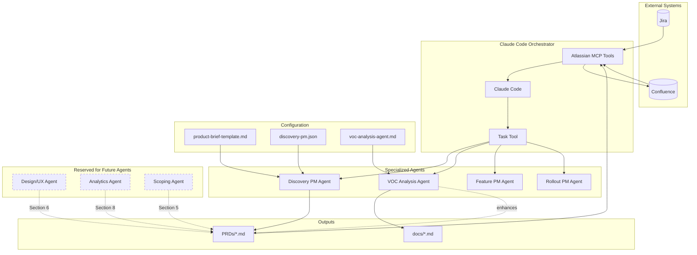
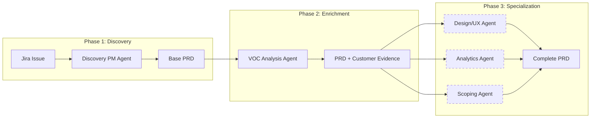

# PM Agent: Agentic Product Management Workflow

An automated product management system that transforms Jira issues into comprehensive PRDs using specialized AI agents, with Voice of Customer integration from Confluence.

## System Architecture



## Overview

PM Agent automates the PRD creation workflow by:

1. **Fetching Jira issues** via Atlassian MCP integration
2. **Invoking specialized agents** to generate comprehensive PRDs
3. **Extracting VOC insights** from Confluence customer feedback
4. **Publishing PRDs** back to Confluence

## Available Agents

| Agent | Location | Purpose |
|-------|----------|---------|
| **Discovery PM** | `.claude/agents/discovery-pm.md` | Creates comprehensive PRDs from Jira issues using standardized template |
| **VOC Analysis** | `.claude/agents/voc-analysis-agent.md` | Analyzes customer feedback from Confluence, extracts themes and verbatims |
| **Feature PM** | `.claude/agents/feature-pm.md` | Translates PRDs into epics, user stories, and backlog items |
| **Rollout PM** | `.claude/agents/rollout-pm.md` | Plans product rollouts, defines KPIs, creates go-to-market strategies |

## Quick Start

### Prerequisites

- [Claude Code CLI](https://claude.com/claude-code) installed
- Atlassian MCP configured with Jira/Confluence access

### Create a PRD from Jira

```bash
# In Claude Code, request a PRD for a Jira issue
> Create a PRD for ADX-198 using the Discovery PM agent
```

Claude Code will:
1. Fetch the Jira issue details
2. Invoke the Discovery PM agent
3. Generate a 12-section PRD
4. Save to `PRDs/` folder

### Publish to Confluence

```bash
> Push PRDs/ADX-198-proof-point-resource-hub.md to Confluence
```

### Run VOC Analysis

```bash
> Run VOC analysis for search-related customer feedback
```

## Project Structure

```
PM Agent/
├── .claude/
│   └── agents/              # Claude Code agent definitions
│       ├── discovery-pm.md
│       ├── feature-pm.md
│       ├── rollout-pm.md
│       └── voc-analysis-agent.md
├── Documentation/           # Agent JSON configurations
│   ├── discovery-pm.json
│   ├── feature-pm.json
│   ├── rollout-pm.json
│   └── pm-automation-specialist.json
├── PRDs/                    # Generated PRD outputs
│   ├── ADX-196-unauthenticated-homepage.md
│   ├── ADX-197-search-v2.md
│   └── ADX-198-proof-point-resource-hub.md
├── Templates/               # PRD template
│   └── product-brief-template.md
├── docs/                    # Documentation and analysis
│   └── VOC-themes-summary.md
└── tech-agent/              # Engineering personas and tools
```

## PRD Template Structure

The 12-section product brief template ensures consistency:

| Section | Owner | Description |
|---------|-------|-------------|
| 1. Overview | Discovery PM | Metadata, stakeholders, Jira reference |
| 2. Background/Context | Discovery PM | Business problem, strategic alignment |
| 3. Target Users | Discovery PM | User segments, behaviors, constraints |
| 4. Objectives/Goals | Discovery PM | Business goals, success metrics framework |
| 5. Scope | Discovery PM + Scoping Agent | In-scope features, out-of-scope TBD |
| 6. Feature Documentation | Design/UX Agent | Wireframes, mockups, UX notes (TBD) |
| 7. Success Metrics/KPIs | Discovery PM + Analytics Agent | Metric framework, specific values TBD |
| 8. Analytics & Tracking | Analytics Agent | Event definitions (TBD) |
| 9. Risks & Considerations | Discovery PM | Risks, impact, mitigations |
| 10. Launch Plan | Discovery PM | Feature flags, rollout, training |
| 11. Post-Launch Plan | Discovery PM | Monitoring, optimization, follow-ups |
| 12. Open Questions | Discovery PM | Questions for stakeholder resolution |

## Multi-Agent Workflow

The system enforces **separation of concerns** where specialized agents handle specific sections:



**Note:** Dashed boxes indicate agents that are planned but not yet implemented.

## Configuration

### Atlassian Integration

The system uses Atlassian MCP tools:
- `getJiraIssue` - Fetch issue details
- `createConfluencePage` - Publish PRDs
- `searchConfluenceUsingCql` - Search for VOC content
- `getConfluencePage` - Retrieve page content

**Cloud ID:** Configure in your MCP settings

### Agent Boundaries

Discovery PM respects boundaries defined in `Documentation/discovery-pm.json`:

```json
{
  "doNotFill": [
    "Feature Documentation (Section 6) - reserved for Design/UX agents",
    "Analytics & Tracking (Section 8) - reserved for Analytics agents",
    "Out of Scope items (Section 5) - reserved for Scoping agents"
  ],
  "mustPreserve": [
    "All TBD placeholders must remain exactly as '[TBD - Pending Agent input]'"
  ]
}
```

## Example PRDs

### ADX-196: Unauthenticated Homepage
- **Focus:** First-time visitor experience, registration conversion
- **Confluence:** Published to ADX Week space

### ADX-197: Search V2
- **Focus:** Coveo Commerce API migration, merchandising capabilities
- **VOC Integration:** 5 customer pain point themes with verbatims
- **Confluence:** Published to ADX Week space

### ADX-198: Proof Point Resource Hub
- **Focus:** Customer enablement, self-service support
- **Target Users:** New customers, returning users, GTM specialists

## VOC Analysis

The VOC Analysis Agent extracts customer insights from Confluence:

### Capabilities
- Automated theme extraction with semantic clustering
- Pain point identification with severity scoring
- Verbatim quote extraction with source attribution
- Trend analysis comparing current to historical data
- PRD-ready problem statements

### Output Format
```markdown
## Customer Problem: [Theme Name]

### Customer Evidence
- "[Verbatim quote]"
  Source: [Document Title] | [Date]
  URL: [Confluence URL]

### Impact
- Frequency: [count] mentions ([percentage]% of feedback)
- Severity: [Critical/High/Medium/Low]
- Trend: [Increasing/Stable/Decreasing]
```

## Self-Scoring & Audit Logging

Every agent output includes comprehensive self-assessment and audit trails.

### Scoring System

| Score Type | Scale | Purpose |
|------------|-------|---------|
| **Confidence** | 0.0-1.0 | Agent's certainty in output quality |
| **Relevance** | 0.00-10.00 | How well output addresses source input |

### Example Scores

```markdown
## Self-Assessment Summary

**Overall Confidence**: 0.85 / 1.0
**Ticket Relevance**: 8.2 / 10.0
**Estimated Human Review Time**: 45 minutes

### Confidence by Section

| Section | Score | Reasoning |
|---------|-------|-----------|
| 1. Overview | 1.0 | Direct mapping from Jira metadata |
| 2. Background | 0.9 | Clear problem, minor assumptions |
| 3. Target Users | 0.85 | Segments inferred, needs validation |
```

### Audit Log Files

Each agent generates a JSON audit log alongside its output:

- `AUDIT_{ticket_id}_{timestamp}.json` - Discovery PM
- `AUDIT_EPICS_{prd_id}_{timestamp}.json` - Feature PM
- `AUDIT_ROLLOUT_{feature_id}_{timestamp}.json` - Rollout PM
- `AUDIT_VOC_{analysis_id}_{timestamp}.json` - VOC Analysis

### Audit Log Contents

- **Metadata**: Agent, version, timestamp, inputs/outputs
- **Section assessments**: Per-section confidence and relevance
- **Decisions made**: Key choices with alternatives considered
- **Assumptions made**: Explicit assumptions with risk analysis
- **Quality checks**: Pass/Fail results for mandatory checks
- **Score improvement recommendations**: Actionable improvement steps
- **Recommended review sequence**: Prioritized human review plan

### Score Improvement Recommendations

Every output includes specific recommendations to improve scores:

```json
{
  "current_score": 8.2,
  "target_score": 9.0,
  "area": "Section 3: Target Users",
  "recommendation": "Add validated user research data",
  "implementation": "Conduct 3 user interviews per segment",
  "estimated_impact": "+0.8 relevance"
}
```

### Minimum Score Thresholds

| Agent | Min Confidence | Min Relevance | Action if Below |
|-------|----------------|---------------|-----------------|
| Discovery PM | 0.70 | 6.0 | Manual review required |
| Feature PM | 0.70 | 6.0 | Product lead approval |
| Rollout PM | 0.75 | 7.0 | GTM team review |
| VOC Analysis | 0.75 | 7.0 | Re-analyze with more data |

For detailed scoring rubrics, see `docs/SCORING_RUBRIC.md`.

---

## Roadmap

### Current State
- [x] Discovery PM Agent - Creates base PRDs
- [x] VOC Analysis Agent - Extracts customer themes
- [x] Feature PM Agent - Backlog creation
- [x] Rollout PM Agent - Launch planning
- [x] Atlassian integration (Jira + Confluence)
- [x] 12-section PRD template
- [x] Self-scoring & audit logging - All agents include confidence scores
- [x] PRD Orchestrator - Coordinates multi-agent workflows

### Planned
- [ ] Design/UX Agent - Wireframe/mockup integration
- [ ] Analytics Agent - Event tracking specifications
- [ ] Scoping Agent - Out-of-scope definitions
- [ ] Score calibration tracking - Monitor score accuracy over time

## Contributing

1. Agent definitions go in `.claude/agents/*.md`
2. JSON configurations go in `Documentation/*.json`
3. PRD outputs go in `PRDs/`
4. Documentation goes in `docs/`

## License

MIT

---

*Built with [Claude Code](https://claude.com/claude-code)*
