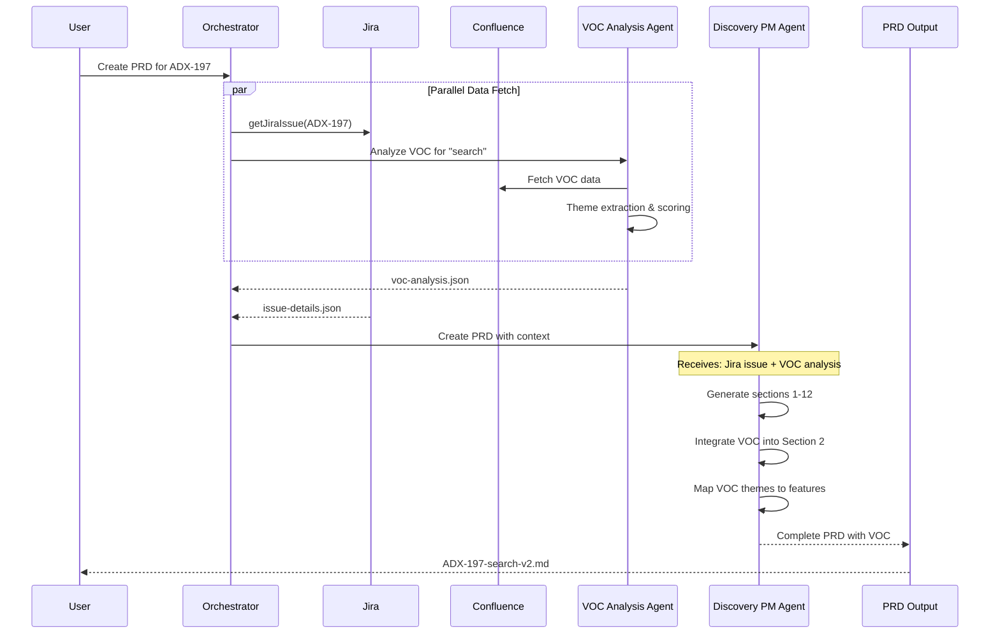

# Agent Collaboration Analysis: VOC Analysis + Discovery PM

## Executive Summary

This document analyzes how the **VOC Analysis Agent** and **Discovery PM Agent** collaborated on ADX-197 (Search V2) PRD, identifies gaps, and provides recommendations for building an orchestration agent.

---

## Agent Execution Timeline

### What Actually Happened

```
Step 1: User Request
        └─> "Create PRD for ADX-197"

Step 2: Claude Code Orchestrator (Manual)
        ├─> Fetched ADX-197 from Jira via MCP
        └─> Invoked Discovery PM Agent via Task tool

Step 3: Discovery PM Agent
        ├─> Read product-brief-template.md
        ├─> Read discovery-pm.json (boundaries)
        ├─> Generated 12-section PRD
        └─> Output: PRDs/ADX-197-search-v2.md

Step 4: Manual VOC Addition (Gap!)
        ├─> User requested VOC integration
        ├─> I manually fetched Confluence page 132841475
        ├─> Manually analyzed and added VOC section
        └─> No agent invocation!

Step 5: VOC Analysis Agent (Now)
        ├─> Invoked via Task tool
        ├─> Connected to Confluence
        ├─> Generated structured analysis
        └─> Output: docs/voc-analysis-report-nov2025.md
```

---

## Comparison: Manual VOC vs Agent VOC

### Existing ADX-197 VOC Section (Manual)

| Theme | Severity | Quotes | Source Attribution |
|-------|----------|--------|-------------------|
| Performance & Speed | P0 | 4 | Location only (FL, CA) |
| Search Functionality | P0 | 3 | Location only |
| App Stability | P1 | 4 | Location only |
| Navigation & State | P1 | 3 | Location only |
| UX Complexity | P2 | 3 | Location only |

**Total Quotes:** 17
**Sources:** State abbreviations only

### VOC Analysis Agent Output (Automated)

| Theme | Severity | Quotes | Source Attribution |
|-------|----------|--------|-------------------|
| Performance & Speed | Critical | 3 | Full: Account name, date, Confluence URL |
| Mobile App Quality | Critical | 3 | Full: Account name, date, Confluence URL |
| Cart/Checkout Failures | High | 3 | Full: Account name, date, Confluence URL |
| Search/Navigation UX | High | 3 | Full: Account name, date, Confluence URL |
| Session/Auth Issues | Medium | 3 | Full: Account name, date, Confluence URL |

**Total Quotes:** 15
**Sources:** Full attribution with URLs

---

## Key Differences

### What VOC Agent Does Better

1. **Full Source Attribution**
   - Account names (RUBAIYAT, MASTROS STEAKHOUSE)
   - Exact dates
   - Confluence URLs for verification
   - QuantumMetric replay links

2. **Structured Output**
   - Markdown report for humans
   - JSON for machine consumption by other agents
   - Standardized severity scoring criteria

3. **Quantified Metrics**
   - Overall sentiment score: -0.74
   - NPS average: 2.4/10
   - CSAT average: 2.8/10
   - Occurrence percentages

4. **Theme Differences**
   - Agent identified "Cart/Checkout Failures" as distinct (26% of feedback)
   - Agent separated "Session/Auth Issues" (13%)
   - Manual analysis merged these into other themes

### What Was Lost

1. **"Search V2 Addressal" Commentary**
   - Manual version explained how each theme connects to Coveo migration
   - Agent version provides raw analysis without PRD context

2. **Quote Volume**
   - Manual: 17 quotes (more verbose)
   - Agent: 15 quotes (limited by 3-per-theme rule)

---

## How Agents Should Work Together

### Ideal Orchestrated Workflow



### Agent Communication Protocol

```json
{
  "orchestration_flow": {
    "step_1": {
      "action": "parallel_fetch",
      "agents": ["jira_mcp", "voc_analysis_agent"],
      "inputs": {
        "jira": "ADX-197",
        "voc": {"keywords": ["search", "find", "results"], "lookback_days": 90}
      }
    },
    "step_2": {
      "action": "invoke_discovery_pm",
      "inputs": {
        "jira_context": "{{step_1.jira_output}}",
        "voc_analysis": "{{step_1.voc_output}}",
        "template": "product-brief-template.md"
      }
    },
    "step_3": {
      "action": "post_process",
      "tasks": [
        "validate_all_sections_filled",
        "verify_voc_attribution",
        "save_to_prds_folder"
      ]
    }
  }
}
```

---

## Orchestration Agent Recommendations

### Core Responsibilities

1. **Workflow Coordination**
   - Invoke agents in correct sequence
   - Pass outputs between agents
   - Handle parallel execution where possible

2. **Context Assembly**
   - Aggregate Jira issue details
   - Collect VOC analysis
   - Pass combined context to Discovery PM

3. **Quality Enforcement**
   - Verify VOC section is populated
   - Check source attributions exist
   - Validate all 12 sections present

4. **Error Handling**
   - Retry failed agent calls
   - Fallback to manual if VOC unavailable
   - Report incomplete sections

### Proposed Orchestrator Configuration

```markdown
---
name: prd-orchestrator
description: Orchestrates PRD creation by coordinating Discovery PM and VOC Analysis agents
model: sonnet
---

## Workflow

When user requests a PRD for a Jira issue:

1. **Fetch Jira Context**
   - Use Atlassian MCP to get issue details
   - Extract keywords for VOC search

2. **Invoke VOC Analysis Agent**
   - Pass keywords and lookback period
   - Receive structured JSON output

3. **Invoke Discovery PM Agent**
   - Pass Jira context + VOC analysis
   - Instruct to integrate VOC into Section 2

4. **Validate Output**
   - Check VOC section has quotes with full attribution
   - Verify all sections completed per boundaries
   - Ensure file saved to PRDs folder

5. **Report Completion**
   - Summarize what was generated
   - List any sections left as TBD
   - Provide Confluence publish option
```

---

## Implementation Gaps to Address

### 1. VOC Section in Template
**Current:** Template has no VOC section
**Needed:** Add "Voice of Customer Insights" as Section 2.1 or expand Section 2

### 2. Agent Input/Output Contract
**Current:** Agents don't have standardized I/O format
**Needed:** Define JSON schema for agent outputs

### 3. Keyword Extraction
**Current:** User must specify VOC search terms
**Needed:** Auto-extract keywords from Jira issue summary/description

### 4. VOC → PRD Mapping
**Current:** VOC themes listed but not connected to features
**Needed:** Discovery PM should map each VOC theme to specific In-Scope features

---

## Next Steps

1. **Create prd-orchestrator agent** in `.claude/agents/prd-orchestrator.md`
2. **Update product-brief-template.md** to include VOC section
3. **Define agent I/O contracts** in Documentation folder
4. **Test orchestrated workflow** with ADX-198

---

## Files Generated

- `docs/voc-analysis-report-nov2025.md` - Full VOC analysis
- `docs/voc-analysis-data-nov2025.json` - Structured data for agents
- `docs/agent-collaboration-analysis.md` - This document
